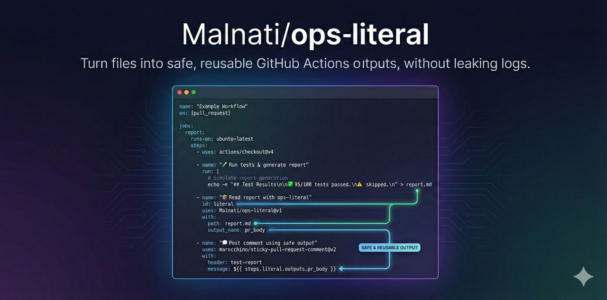
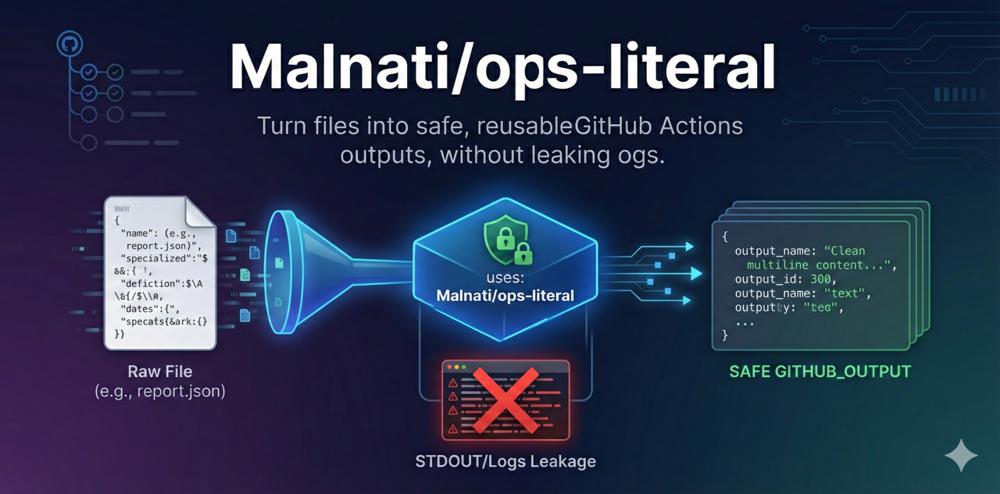

<!-- README.md -->
<h1 align="center">Malnati/ops-literal</h1>

<p align="center">
  <b>Turn files into safe, reusable GitHub Actions outputs (multiline-ready), without leaking logs.</b>
</p>

<p align="center">
  <a href="https://github.com/Malnati/ops-literal/releases">
    
  </a>
  <a href="https://github.com/Malnati/ops-literal/blob/main/LICENSE">
    
  </a>
  
</p>

<p align="center">
  <a href="https://github.com/Malnati/ops-literal"><b>Repository</b></a>
  •
  <a href="https://malnati.github.io/ops-literal/"><b>Landing Page</b></a>
  •
  <a href="https://github.com/marketplace/actions/ops-literal"><b>Marketplace</b></a>
  •
  <a href="https://github.com/Malnati/ops-literal/issues"><b>Issues</b></a>
</p>

<p align="center">
  <a href="https://github.com/Malnati/ops-literal">
    
  </a>
</p>

<hr/>

## What it is

**ops-literal** is a GitHub Action that reads a file (or a raw string) and exports it as a **safe, multiline output** for downstream steps.

It is designed for IssueOps / PR automation flows where you need to reuse generated artifacts (reports, markdown, JSON) in:
- PR bodies
- timeline comments
- job summaries
- other actions inputs

…without printing full content to logs.

<p align="center">
  <a href="https://github.com/Malnati/ops-literal">
    
  </a>
</p>

## Why

GitHub Actions has a few sharp edges around:
- multiline values
- output escaping
- accidentally leaking logs
- having to “re-implement file reading” in every workflow

This action standardizes the “read → sanitize → optionally truncate → export” workflow.

## Features

- ✅ Read from `path` (recommended) or from `text`
- ✅ Multiline-safe outputs (ready for Markdown/JSON)
- ✅ Optional size limit + truncation indicator
- ✅ Optional hashing (for traceability)
- ✅ No default content printing to logs

## Quick start

### Example: export a report file content (safe output)

```yml
- name: "📦 Export report as literal"
  id: literal
  uses: Malnati/ops-literal@v1
  with:
    path: .reports/20251215-1530_hardcode.json
    max_bytes: 80000
    output_name: report

- name: "🧾 Use in Job Summary"
  shell: bash
  run: |
    printf '%s\n' "${{ steps.literal.outputs.report }}" >> "$GITHUB_STEP_SUMMARY"
```

#### Example: export only the filename (basename)

```yml
- name: "📦 Export filename"
  id: literal_name
  uses: Malnati/ops-literal@v1
  with:
    path: .reports/20251215-1530_hardcode.json
    output_name: filename
    mode: basename

- name: "🔎 Show filename"
  run: echo "${{ steps.literal_name.outputs.filename }}"
```

#### Inputs

##### Input	Required	Default	Description
- path	no*	—	File path to read (preferred).
- text	no*	—	Raw text to export as output.
- output_name	no	literal	Output key name.
- mode	no	content	content | basename | sha256
- max_bytes	no	0	If > 0, truncates output to this size (bytes).
- trim	no	true	Trim trailing whitespace/newlines.
- fail_on_missing	no	true	Fail if path does not exist (when path is used).

* Provide either path or text.

#### Outputs

##### Output	Description
- `<output_name>`	The exported value (content/basename/hash depending on mode).
- bytes	Byte size of the original content.
- truncated	true if truncation happened.

### Recommended patterns

#### Use with PR/comment actions

```yml
- name: "📦 Render PR body"
  id: pr_body
  uses: Malnati/ops-literal@v1
  with:
    path: .github/workflows/hardcode-pr.md
    output_name: body
    max_bytes: 80000

- name: "💬 Post comment"
  uses: Malnati/pr-comment@v1
  with:
    token: ${{ secrets.GITHUB_TOKEN }}
    pr_number: ${{ github.event.issue.number }}
    body: ${{ steps.pr_body.outputs.body }}
```

###### Use with reports (avoid printing content)
- Prefer max_bytes to keep outputs predictable.
- Prefer writing to $GITHUB_STEP_SUMMARY over echoing large payloads to the log.

###### Security notes
- This action should not print file content by default.
- Never feed secrets into text or path content that might be posted publicly (PR comments, summaries, artifacts).
- Use GitHub permissions minimally (this action does not need extra permissions by itself).

#### Versioning

###### This project uses semantic versioning.
- Pin to a major version: Malnati/ops-literal@v1
- Or pin to an exact tag: Malnati/ops-literal@v1.0.0

### License

MIT. See LICENSE.
